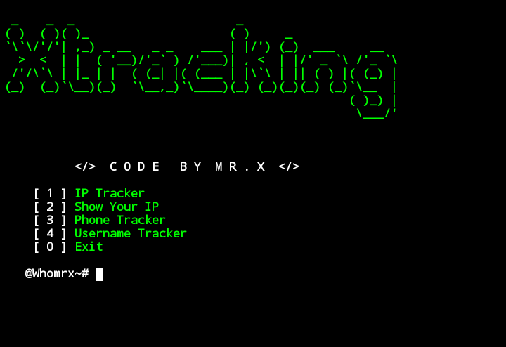

# Xtracking 


## introduction
This is a tool for tracking someone

## Instalations
```
$ apt update
$ apt upgrade
$ pkg install git
$ pkg install python
$ pkg install python3
$ git clone https://github.com/Whomrx666/Xtracking.git
$ cd Xtracking 
$ pip install -r requirements.txt
$ python3 Xtracking.py
```

## Instructions
- **IP Tracker**: To track someone's IP address 
- **Show Your IP**: To see your own IP address
- **Phone Tracker**: To track someone's phone number
-**Exit**: To exit tools
### Original Author
<a href="https://github.com/Whomrx666"></a>

Follow me: [Whatsapp](https://wa.me/6287855190571),[Youtube](https://youtube.com/@whomrx666),[Tiktok](https://www.tiktok.com/@whomr.x),[Telegram](https://www.tiktok.com/@whomr.x),[Telegram](https://t.me/@Whomr_X),&[Website](https://whomrxhackers.blogspot.com/)
